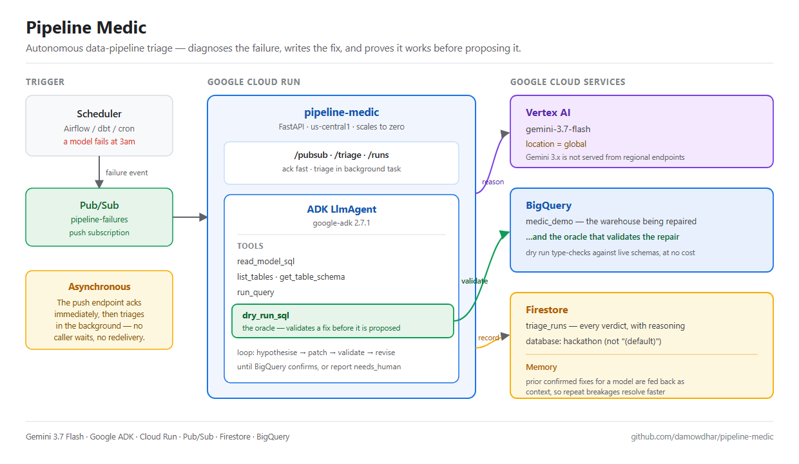

# Pipeline Medic

**An autonomous on-call agent for data pipelines.** When a pipeline model breaks, Pipeline Medic diagnoses the root cause, writes a fix, and *proves the fix works* against the live warehouse — before any human wakes up.

Built for the [All Things Agentic Hackathon](https://allthingsagentichackathon.devpost.com/) · Track: **The Taskmaster**

**Live on Cloud Run:** https://pipeline-medic-333215501397.us-central1.run.app · [`/healthz`](https://pipeline-medic-333215501397.us-central1.run.app/healthz) · [`/runs`](https://pipeline-medic-333215501397.us-central1.run.app/runs)

---

## The problem

A data pipeline fails at 3am. The error says `Name customer_id not found inside c`. That's a symptom, not a cause. Someone gets paged, opens six browser tabs, compares the model SQL against the current warehouse schema, discovers an upstream team renamed a column three days ago, and pushes a one-line fix. Forty minutes, most of it spent re-deriving context a machine could have gathered instantly.

Pipeline Medic does that work autonomously, and — critically — **does not guess**.

## What makes it autonomous rather than suggestive

Most "AI fixes your code" demos produce a plausible patch and hand it to a human to evaluate. That just moves the work.

Pipeline Medic is required to *demonstrate* its fix is correct. Its key tool is BigQuery's **dry-run** mode, which type-checks a query against real table schemas without executing it or costing anything. That gives the agent a ground-truth oracle:

1. Read the failing model's SQL
2. Inspect what the upstream tables **actually** contain now (not what the error claims)
3. Form a hypothesis about the root cause
4. Write a candidate fix
5. **Dry-run it.** If BigQuery says no, read the real compiler error, revise, try again
6. Only report a fix marked `validated: true` once the warehouse itself has confirmed it compiles

The agent isn't trusted to be right the first time. It's required to iterate until it's provably right. A fix that never validates is reported honestly as `needs_human` rather than dressed up as an answer.

### A real run

The demo scenario is an upstream column rename (`customer_id` → `cust_id`). From a cold start, the agent:

```
root cause  : The upstream table raw_customers renamed the customer_id column
              to cust_id, causing references to c.customer_id to fail.
validated   : True
confidence  : high
tool calls  : 6
dry runs    : 1
```

It also chose to keep `AS customer_id` as the *output* column name while switching the source to `c.cust_id` — preserving the contract for everything downstream. Nothing in the prompt told it to do that.

---

## Architecture



<details>
<summary>Text version</summary>

```
   Scheduler / Airflow / dbt              ┌──────────────────────────┐
   (a pipeline model fails)               │      Vertex AI           │
              │                           │   gemini-3.7-flash       │
              │  failure event            │   (location: global)     │
              ▼                           └────────────┬─────────────┘
   ┌─────────────────────┐                             │ reason + tool calls
   │   Pub/Sub topic     │                             │
   │  pipeline-failures  │                             ▼
   └──────────┬──────────┘              ┌──────────────────────────────┐
              │  push                   │      ADK LlmAgent            │
              ▼                         │      "Pipeline Medic"        │
   ┌─────────────────────┐  triage      │                              │
   │     Cloud Run       │─────────────▶│  tools:                      │
   │   pipeline-medic    │              │   read_model_sql             │
   │   (FastAPI)         │◀─────────────│   list_tables                │
   └──────────┬──────────┘   verdict    │   get_table_schema           │
              │                         │   dry_run_sql   ◀── oracle   │
              │ record                  │   run_query                  │
              ▼                         └──────────────┬───────────────┘
   ┌─────────────────────┐                             │ validate
   │      Firestore      │                             ▼
   │    triage_runs      │              ┌──────────────────────────────┐
   │  (memory of past    │              │         BigQuery             │
   │   fixes per model)  │              │   medic_demo warehouse       │
   └─────────────────────┘              └──────────────────────────────┘
```

</details>

**Asynchronous by design.** The Pub/Sub endpoint acknowledges the message *immediately* and runs triage in a background task. Triage takes several model turns and BigQuery round trips — far longer than Pub/Sub's ack deadline — so acking first is what prevents duplicate redelivery and makes the agent genuinely fire-and-forget. Nobody is waiting on an HTTP response.

**Memory.** Every run is written to Firestore. When a model that has failed before fails again, prior confirmed fixes are fed back in as context, so recurring breakages get faster and more consistent rather than being re-derived from scratch.

### Hackathon requirements

| Requirement | How it's met |
|---|---|
| Gemini 3.5 or newer | `gemini-3.7-flash` via Vertex AI |
| Google agent framework | **ADK** (`google-adk` 2.7.1) — `LlmAgent` + `Runner` with six function tools |
| Google Cloud service | **Cloud Run** (host), **Pub/Sub** (async trigger), **Firestore** (state/memory), **BigQuery** (the warehouse it repairs) |

---

## Spin-up instructions

### Prerequisites

- Python 3.12+
- `gcloud` CLI, authenticated
- A Google Cloud project with billing enabled

### 1. Enable the APIs

```bash
gcloud services enable aiplatform.googleapis.com run.googleapis.com cloudbuild.googleapis.com artifactregistry.googleapis.com pubsub.googleapis.com firestore.googleapis.com bigquery.googleapis.com
```

### 2. Create the Firestore database

```bash
gcloud firestore databases create --database=hackathon --location=us-central1 --type=firestore-native
```

### 3. Install and configure

```bash
python -m venv .venv && . .venv/bin/activate    # Windows: .venv\Scripts\activate
pip install -r requirements.txt
cp .env.example .env                             # then edit GOOGLE_CLOUD_PROJECT
```

> **Two settings are load-bearing and easy to get wrong.**
> `GOOGLE_CLOUD_LOCATION` must be **`global`** — Gemini 3.x is not served from regional Vertex endpoints, and a region returns a 404 that reads like a permissions error but isn't. And `FIRESTORE_DATABASE` must name your database explicitly; client libraries silently default to `(default)` and will read an empty database without complaining.

### 4. Seed the demo warehouse

```bash
python -m demo.seed
```

Creates `medic_demo.raw_customers` and `medic_demo.raw_orders` — with the column rename already applied, so the pipeline is broken by design and the failure is reproducible on every run.

### 5. Watch it work locally

```bash
python -m demo.local_test
```

Runs the broken model, captures the real BigQuery error, hands it to the agent, and prints the verdict.

### 6. Deploy to Cloud Run

```bash
./deploy.ps1        # PowerShell; creates SA, topic, service, and push subscription
```

Then trigger it asynchronously:

```bash
python -m demo.break_it                          # publish to Pub/Sub
gcloud run services logs tail pipeline-medic --region us-central1
```

Or synchronously, to watch the verdict come back:

```bash
python -m demo.break_it --url https://YOUR-SERVICE.run.app
```

### Endpoints

| Method | Path | Purpose |
|---|---|---|
| `GET` | `/healthz` | config check — model, location, database |
| `POST` | `/pubsub` | Pub/Sub push target; acks immediately, triages in background |
| `POST` | `/triage` | synchronous triage, for demos and testing |
| `GET` | `/runs` | recent triage runs, newest first |
| `GET` | `/runs/{run_id}` | one run in detail |

---

## Local development note

If you already use `gcloud` for a different (e.g. work) account, **do not** run `gcloud auth application-default login` — ADC is global, not per-configuration, and it will overwrite those credentials. Isolate instead:

```bash
export CLOUDSDK_CONFIG=~/hackathon/.gcloud
gcloud auth application-default login
export GOOGLE_APPLICATION_CREDENTIALS=$CLOUDSDK_CONFIG/application_default_credentials.json
```

## Safety

`MEDIC_ALLOW_PRS` is `false` by default. The agent writes its validated patch to Firestore rather than pushing anything. Opening pull requests is opt-in — an agent that can autonomously modify a production repository should be a deliberate choice, not a default.

`deploy.ps1` uses `--allow-unauthenticated` so hackathon judges can reach the URL. For real use, drop that flag and require an OIDC token on the Pub/Sub push subscription.

## Repository layout

```
app/
  config.py     configuration; documents the global-endpoint and database-id traps
  agent.py      the ADK LlmAgent, its instruction, and the triage loop
  tools.py      the six tools, including the dry-run oracle
  state.py      Firestore persistence and prior-fix recall
  server.py     FastAPI service: Pub/Sub push + sync triage + run history
demo/
  seed.py       builds the demo warehouse with the break already applied
  models/       the pipeline model SQL the agent reads and repairs
  break_it.py   stands in for a scheduler: runs the model, emits the failure
  local_test.py end-to-end triage without deploying
Dockerfile
deploy.ps1
```
